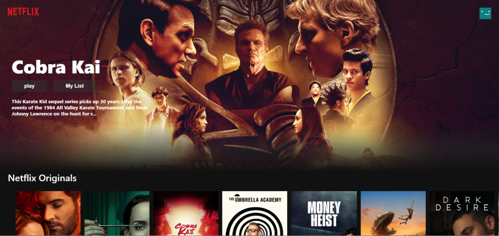

# Video Streaming Service App - Design of [Netflix-Clone](https://netflix-clone-51ed1.web.app)

 

### General Highlights of the Netflix-Clone App:

    
   |    Highlights                    |                         Description                                                                            |
   | :------------------------------: | ---------------------------------------------------------------------------------------------------------------|  
   | **Responsive Design:**           | The App works well both on PC and mobile                                                                       |
   | **Smooth Scrolling Effect:**     | Header background initially appears tranparent with only the Logo and user avatar. After scrolling down for 100px, a black background ease-in smoothly                                                                                                                      |
   | **onClick Movie Trailer Popup:** | Clicking on the video thumbnail would prompt up the relative Youtube Trailer of the such video                 |
   | **data fetching from API:**      | All movie infos are directly fetched from the TMDb[[2]](#fn_2) with their API       |
   
    
   
---

### Languages and Tools:

| Syntax | Description |
| ----------- | ----------- |
| Framework | React.js with Hooks/Function Component |
| Languages | Javascript/CSS in BEM[2](#fn_2)/HTML|
| Code Editor | Visual Studio Code |
| Hosting | Firebase Hosting Service |
| Database | The Movie Database (TMDb) |

- *All code for this project could be found in the 'src' folder.*

---

### External Plugins 

---

### Components

---

### My Other Open Source Projects

---

### Footnodes

<b id="fn_1">[1]</b> TMDB is a popular user editable database for movies and TV shows. [↩](#footnode_1)  
<b id="fn_2">[2]</b> BEM refers to the Block, Element, Modifier methodology which allows code to be scalable and reusable. [↩](#footnode_2)  

